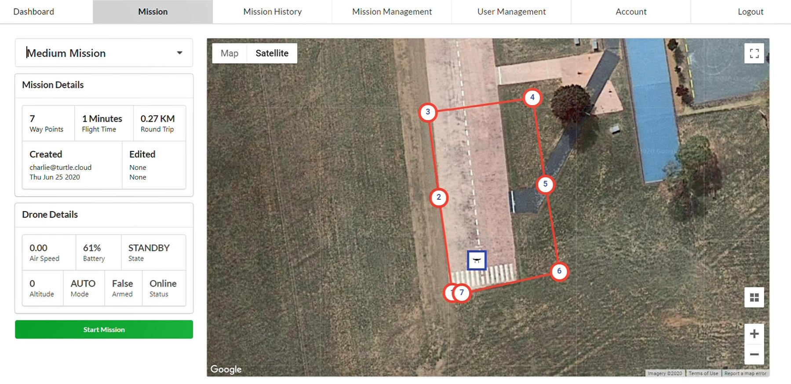
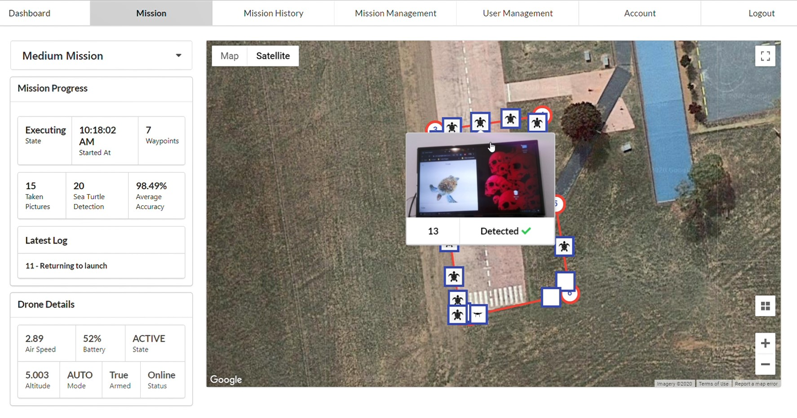
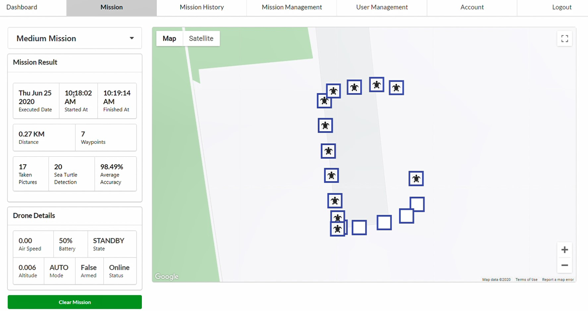

# Airborne Coast Monitoring System for Sea Turtle Detection and Species Classification

 

### Written using React.js and Semantic UI.
### Fully firebase integrated: Real-time DB, Firestore, Storage, Hosting, Auth, ML Kit

#### [Check the deployed version!](https://seaturtle.cloud/)
- Login: demo@metu.edu 
- Pass: demo123

