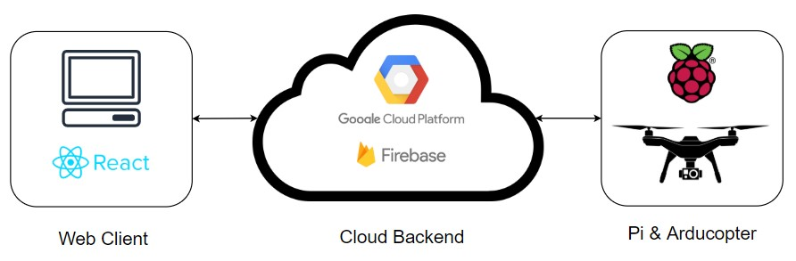
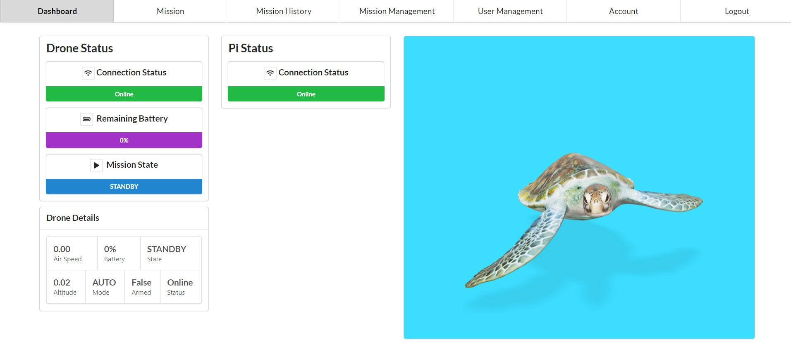
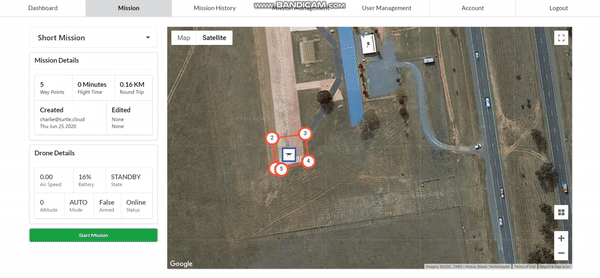
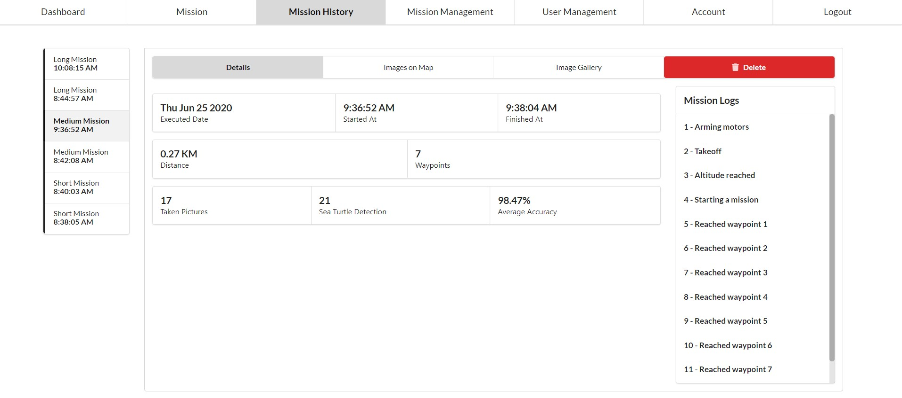
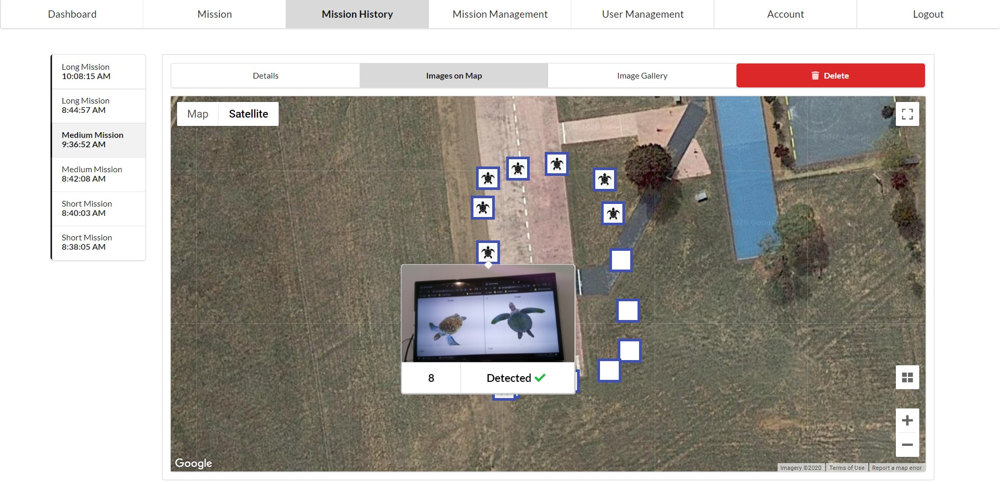
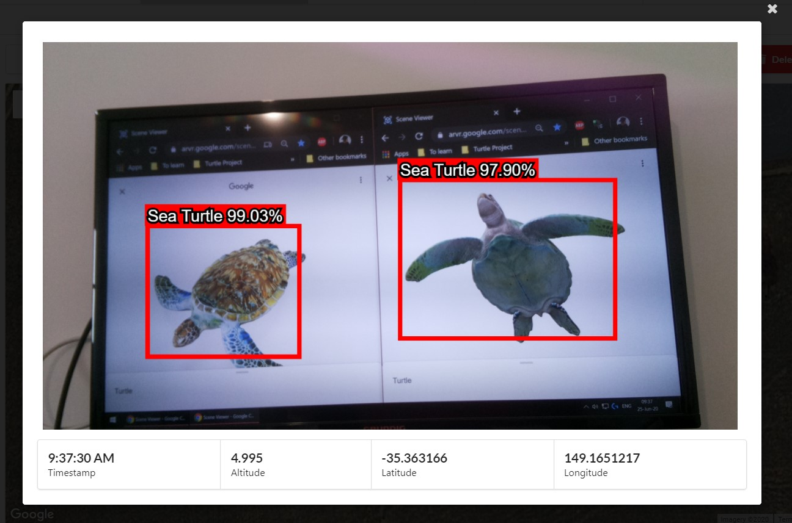
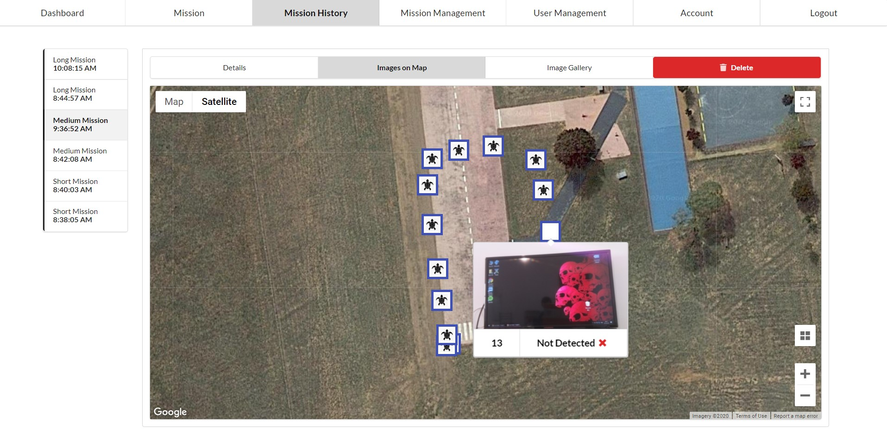
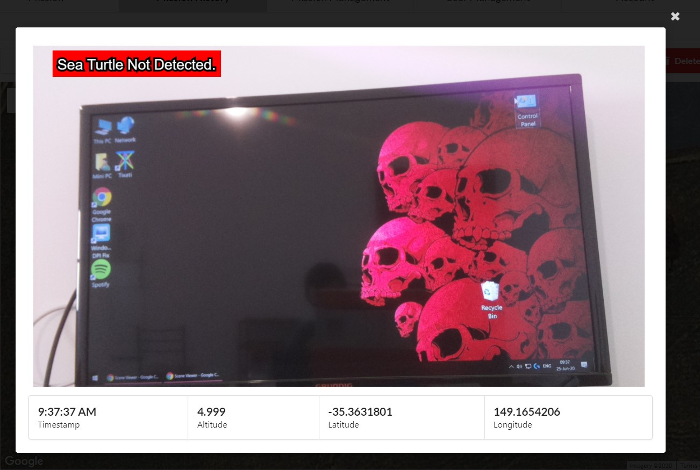
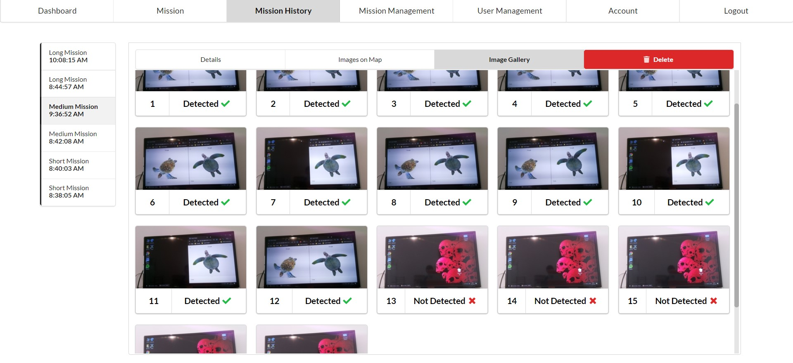

# Airborne Coast Monitoring System for Sea Turtle Detection and Species Classification

 

### React.js and Semantic UI based web client / portal for the system.

### Used Firebase Modules: Real-time DB, Firestore, Storage, Hosting, Auth, ML Kit

#### Homepage

#### Mission Management Page (CRUD) - Demo

#### Mission Execution Page - Demo

#### Mission History Page

